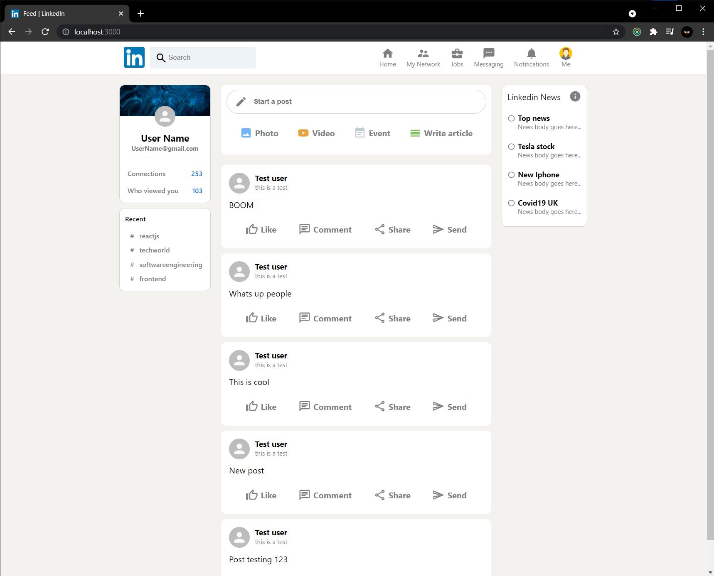

## Linkedin Clone
This project is a basic features replica of Linkedin clone. It is connected with Firebase for user authentication and post storage.

### Tools used
- ReactJS
- Redux
- Firebase 
- Material UI core
- Material UI icons

## Project Screenshot

 Screenshot: Linkedin Feed page

The firebase authentication is not implemented yet. Also for adding new post to the app, firebase.js file with firebase api configurations need to be added.

